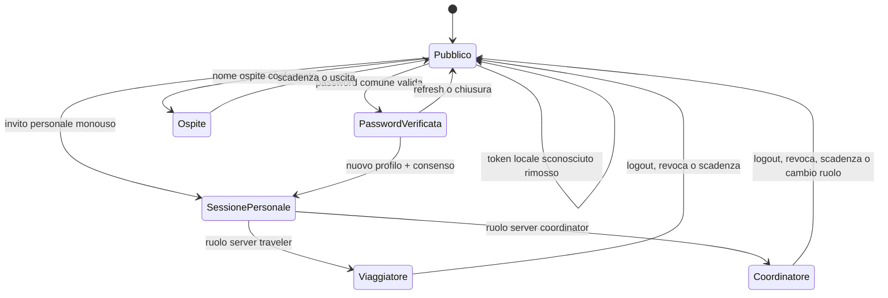

# Stati di accesso — 1.41.0

| Stato verificato | Etichetta in testata | Stato nel pannello | Possibilità | Recupero sicuro |
|---|---|---|---|---|
| Nessuna password, nessuna sessione | Pubblico | Accesso pubblico | Consultazione pubblica; identità ospite per interagire | Password comune per creare un nuovo profilo oppure invito personale per un profilo esistente |
| Password comune valida, nessuna sessione | Pubblico | Password verificata · profilo non collegato | Nessun privilegio personale; documenti e operazioni private restano bloccati | Creare il proprio profilo con consenso oppure aprire il proprio invito personale |
| Profilo locale, nessuna sessione valida | Pubblico | Accesso pubblico | Nessuna impersonificazione automatica | Richiedere un nuovo invito personale |
| Ospite valido | Nome ospite | Identità ospite attiva | Commenti e reazioni sui contenuti visibili | Scadenza, uscita ospite o invito personale |
| Viaggiatore valido | Nome viaggiatore | Accesso personale attivo | Funzioni personali e del gruppo previste dalla matrice | Logout, revoca o scadenza |
| Coordinatore valido | Nome coordinatore | Accesso personale attivo | Coordinamento previsto dalla matrice | Logout, revoca, scadenza o cambio ruolo server |
| Sessione scaduta o revocata | Pubblico | Accesso pubblico | Nessuna funzione privata; eventuale bozza locale resta conservata | Riaprire un nuovo invito personale autorizzato |
| Token locale sconosciuto | Pubblico | Accesso pubblico | Token, profilo e ruolo locali vengono rimossi | Aprire un invito personale valido |

Precedenza non modificabile dal browser: **sessione server valida → ruolo server → profilo server → dati locali di sola presentazione**. La password comune non sostituisce una sessione personale e non può aggirare un diniego `401` o `403`.
